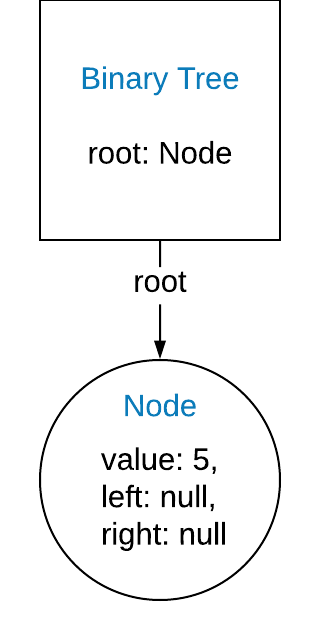
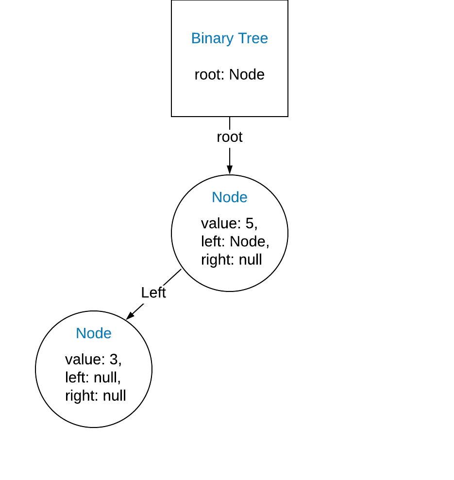
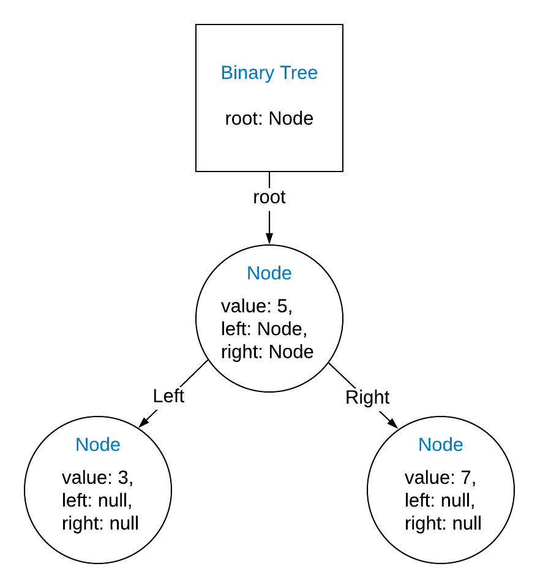
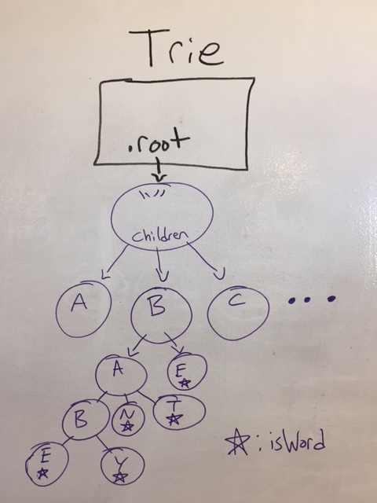

# Binary Trees

This lesson will cover the advanced, node-based data structures known as Trees. In Linked Lists, we saw that a node could point to another node in the list, and we could traverse through the entire list using those pointers.

What if I told you a node could have several pointers? If a node could connect to several different nodes, we wouldn't be limited to a straight line of nodes, as in the Linked List. In fact, there's no limit to the kind of node structures we could build. Trees take this concept a bit further than a Linked List, but still have some fundamental structure to them.

We're going to cover two different types of Trees: Binary Trees and Tries.

---

#### Review Question/Check for Understanding
Multiple choice: Which of the following properties does a node have in a singly linked list? Choose as many as apply.

a) previous
b) data
c) next
d) head
e) walker

Answers: b, c

---

## Binary Trees

In a binary tree, we start with a root node, much like the head of a Linked List. From there, each node, including the root, will have a `left` and `right` property that points to the next nodes in the tree. The `left` property will point to a node with a lesser value than the current node, while the `right` property will point to a node with greater value. As we add new nodes to the Tree, we use this logic to find each new node's proper place in the structure.

Let's say we have a new binary Tree, and have added a single node with a numeric value of 5. In actual applications, this might represent an id in a database,or be an identifying string to be alphabetically sorted.

So far our tree looks like this:

```javascript
{   
    root: {
        value: 5,
        left: null,
        right: null
    }
}
```



Once we add a node, the functionality of adding a node will check the new nodes value against the existing nodes in the tree, starting with the root. So if we add a node with value 3 to the tree, it will go to the left of the root node, since 3 is less than 5.

```javascript
{   
    root: {
        value: 5,
        left: {
            value: 3,
            left: null,
            right: null
        },
        right: null
    }
}
```



And if we want to add a node with value 7 to the tree, it would go to the right of the root node:

```javascript
{   
    root: {
        value: 5,
        left: {
            value: 3,
            left: null,
            right: null
        },
        right: {
            value: 7,
            left: null,
            right: null
        }
    }
}
```



This is a very efficient process of keeping a collection of data sorted, even as we insert more elements. Since we can effectively eliminate half of the tree from our process each time we move left or right, you might recognize this process as a binary search. Inserting a new node in a balanced Binary tree, therefore, has an O(log(n)) complexity. 

Searching for a specific element uses the same process of checking an individual node, comparing it against the value being searched for, and moving left or right in the tree. You can see why Binary Trees are often used behind the scenes in databases to optimize searches and keep data sorted.

### Traversing a Binary Tree

When searching for or inserting a specific node, travelling through the Binary Tree is very similar to traversing a Linked List. You can use a while loop and currentNode pointer to keep moving until you find an empty spot or the specific node you're looking for, and stop once you've reached it. However, many binary tree methods and problems will require traversing multiple paths along the tree- travelling both left and right to make comparisons and calculations.

For example, an algorithm to check the total size of a Binary Tree must encompass all possible directions from all nodes. While this can be done iteratively, you should be thinking of recursion to solve the task of calculating multiple paths or possibilities. In psuedo-code, calculating the size of a Binary Tree might perform the following process at each node, starting at the root:

```
Count the current node in the total.
Move left, and repeat this process.
Move right, and repeat this process.
``` 

### Breadth vs. Depth First Operations

There are two ways to end up traversing a Binary Tree: breadth-first or depth-first. A breadth-first operation will scan each level of the tree before moving down to any further levels, while a depth-first operation will immediately plunge down as far as possible down the first path it finds before trying the next path.

In most cases, Depth-First traversal makes the most sense. Searching and inserting into a tree both should be done by advancing one level at a time, depth-first. However, Breadth-First traversal can make sense for ordering the elements according to their level in the tree. A game-decision tree, for example, might use breadth-first traversal to examine all possible moves at a given stage in the game, instead of going depth-first and analyzing one possible path through the entire game.

## Tries

A Trie, short for "retrieval," is a specific kind of Tree structure in which nodes aren't limited to just using left and right pointers. Instead, each node can store a list of "children" nodes that represent possible paths forward in the Tree from the current node.

The collection of children nodes can be stored various ways. The most straightforward method is to use an array and push children nodes into that array as they are added to the Trie. Another method might use an object, with the child node's data property used as the key to access that node. Yet another implementation might use a Linked List, and give each child node a `.next` pointer to the next child in the list. Each method comes with its own trade-offs, so you'll have to analyze which works best for any given use case.

A common use case for a Trie is language structures, such as words. Each word is composed of a sequence of letters, which could be stored in a Trie with a node for each letter. A letter node would store its letter as the `.data` property, and a list of children nodes representing paths forward through the Trie to complete words. Word-based operations such as spell-check or autocomplete could then use the Trie to analyze existing paths using nodes. 
 
Each letter node in the Trie should also have an `isWord` property to determine whether the collection of letters so far adds up to a complete word or not. Even though "breakfa" is a valid path through a Trie of the English language, you wouldn't want your methods to treat that path as a legitimate word. Only the final node in the word, the "t" node in "breakfast," leads us to a legitimate result searching from "breakfa." You could add more useful properties to each node, such as how many times a user selected that word as an autosuggest response, or how many search queries have used that word.



#### Conclusion

Binary Trees are an excellent way of keeping a set of data intelligently sorted and easily searchable through the binary search method. There are countless applications of Binary Trees, which are useful in any context requiring storage and retrieval of information. Binary trees are typically implemented behind the scenes in the many libraries and databases you'll use, so you won't often have to build one yourself.

While what we've covered so far is enough to create a basic Binary Tree, this simple implementation leaves us with potential problems of an unbalanced tree. The powerful efficiency of a Binary Tree can only happen when the Tree is balanced, an issue that we'll address in the next lesson: Balancing Binary Trees.