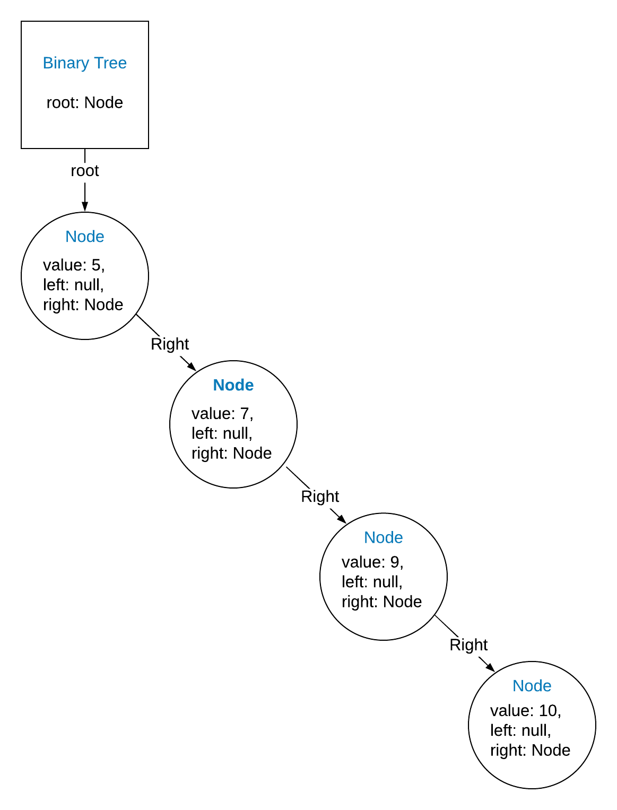
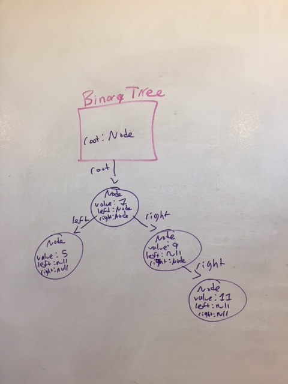
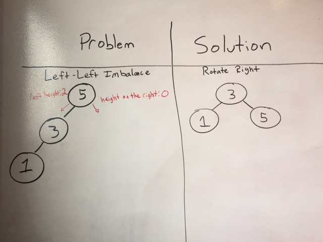
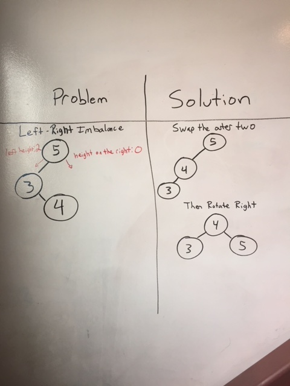
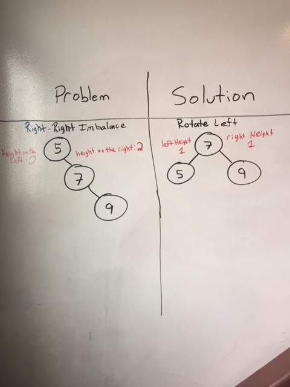
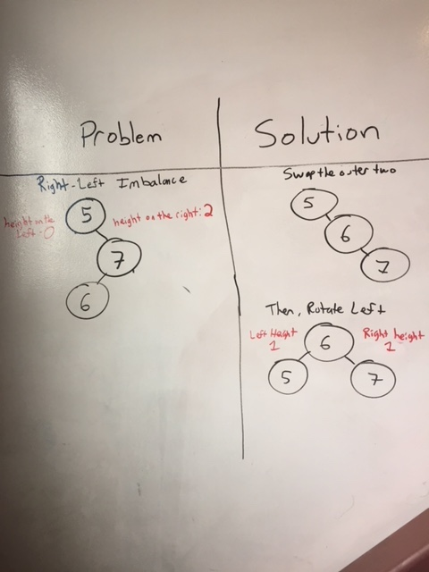

### Balancing a Binary Tree

You might have noticed that searching/inserting nodes in a <i>balanced</i> Binary Tree has O(log(n)) complexity. The concept of an <i>unbalanced</i> tree is one of the potential problems with the Binary Tree structure, as the powerful efficiency it provides is dependent on the tree being balanced.

What if our root node is 5, but what if we keep adding nodes, each one with a greater value than the last? Each new node would keep travelling right until it found the empty spot at the end. Our Tree would have one gigantic right side, with nothing on the left- it would more closely resemble a Linked List, at which point we've lost the efficiency gains of a Binary Tree.

A good Binary Tree should be able to track whether it is a balanced tree, and have the ability to re-balance itself when it falls out of balance. To balance the tree given above, we would want to *rotate* the tree to the left, so that 7 is the new root node. Since the heights of the two sides only differ by one, we can consider this tree balanced.

Depending on the size of the tree, however, the amount of rotations required to fix an unbalanced tree might become expensive to process. Additionally, you have to account for the problem of when to check if a Tree is balanced and requires re-balancing, which can itself be an expensive operation. While there are algorithms that can solve the issue of balancing a Binary Tree in O(n) time, it might be preferable to avoid the problem altogether with a Binary Tree that could balance itself as new elements are inserted.

#### Self-Balancing Binary Trees

There are a lot of alternative methods for realizing the dream of a self-balancing Binary Tree. We'll discuss the first self-balancing tree invented, an AVL tree (named after inventors Adelson, Velsky, and Landis). Implementing an AVL tree will exercise the same concepts and in-depth analysis required to implement other self-balancing trees.

First, it is necessary to have a method for calculating the height of any given sub-tree in the Binary Tree. Starting from a given node, the `setHeight` method should be able to calculate the longest possible path of nodes forward in the tree. We can use recursion to determine the height of any and all nodes in the tree by relying on the height calculation of a node's left and right sub-trees.

The height of a given node can be expressed as the maximum between the height of its left and right sub-trees. The base case is when a node has no further left or right nodes (a.k.a. a "leaf" node) and can return its own height as either 1 or 0 (different AVL implementations treat the problem of whether height includes the root or not differently). In many AVL tree implementations, the height of a given node is stored as a property of the node itself, and adjusted after insertions or deletions that would alter the height.

To determine the balance factor of a given node, we can compare the height of the right sub-tree against the height of the left sub-tree. If the difference between the two sides is greater than 1, the tree is out of balance, according to the AVL tree's strategy. To solve this problem, we perform a series of rotations of nodes to bring the tree back into balance. There are four scenarios of imbalance in an AVL tree, each requiring a specific set of rotations in response. To make these rotations, we'll have to carefully keep track of several nodes by creating variables to reference them, then change their left and right pointers to create the new structure.

Left-Left: rotate right.

Left-Right: swap the outer two, rotate right.

Right-Right: rotate left.

Right-Left: swap the outer two, rotate left.

Since these rotations might cause other imbalances further up the tree, any modification of the tree would follow the branches up and fix any imbalances it finds, one level at a time.

You can watch an AVL tree insert and delete nodes, working through the logic of balancing heights, [here](https://www.cs.usfca.edu/~galles/visualization/AVLtree.html).